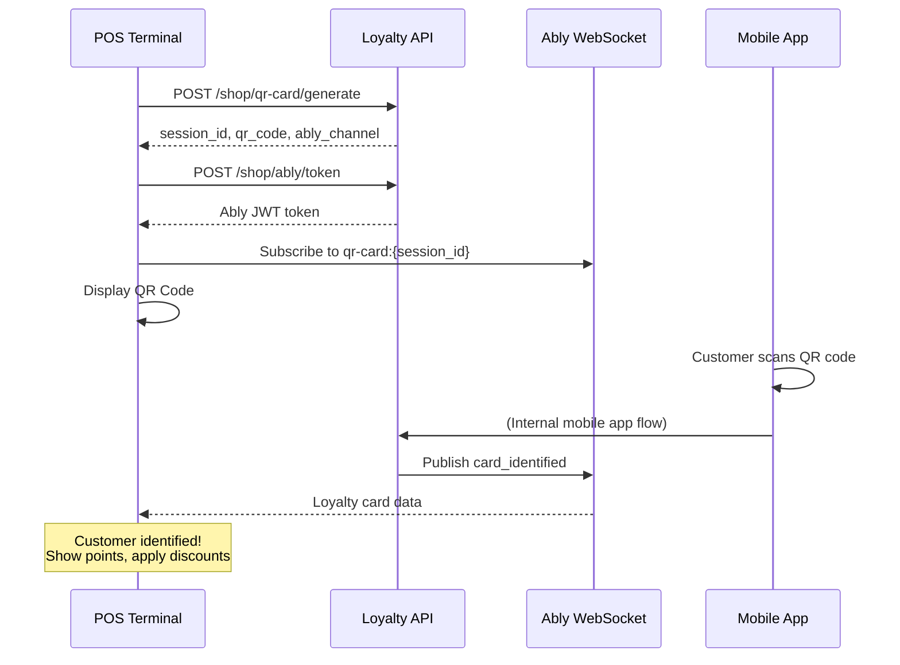

# QR Card Scan System

The QR Card Scan system allows POS terminals to instantly identify customers by displaying a QR code. When a customer scans this QR code with their Loyalty.lt mobile app, their loyalty card data is automatically sent back to the POS system in real-time.

<Info>
Unlike QR Login which authenticates users for web sessions, QR Card Scan is designed specifically for **POS integration** - instantly identifying customers and retrieving their loyalty card data without any confirmation steps.
</Info>

## How It Works



## Key Differences from QR Login

| Feature | QR Login | QR Card Scan |
|---------|----------|--------------|
| **Purpose** | Authenticate user for web session | Identify customer at POS |
| **User Action** | Scan + Confirm in app | Scan only (instant) |
| **Returns** | JWT tokens for session | Loyalty card data |
| **Use Case** | Shop plugins, web integrations | POS systems, kiosks |
| **Ably Channel** | `qr-login:{session_id}` | `qr-card:{session_id}` |
| **Deep Link** | `loyaltylt://qr-login?...` | `loyaltylt://qr-card?...` |

---

## Generate QR Card Session

Create a new QR session for customer identification at POS.

### Endpoint

```
POST /{locale}/shop/qr-card/generate
```

### Authentication

<ParamField header="X-API-Key" type="string" required>
  Partner API key from Partners Portal
</ParamField>

<ParamField header="X-API-Secret" type="string" required>
  Partner API secret from Partners Portal
</ParamField>

### Request Body

<ParamField body="device_name" type="string">
  Name for the POS terminal or device
  
  **Example:** `"POS Terminal 1"`, `"Checkout Counter 3"`
</ParamField>

<ParamField body="shop_id" type="integer">
  Shop ID for multi-location partners (optional)
</ParamField>

### Response

<ResponseField name="success" type="boolean">
  Indicates if session was created successfully
</ResponseField>

<ResponseField name="data" type="object">
  <Expandable title="data">
    <ResponseField name="session_id" type="string">
      Unique session identifier (UUID) - used for Ably channel subscription
    </ResponseField>
    
    <ResponseField name="qr_code" type="string">
      Deep link URL for QR code: `loyaltylt://qr-card?code={code}&session={session_id}`
    </ResponseField>
    
    <ResponseField name="ably_channel" type="string">
      Ably channel name to subscribe to: `qr-card:{session_id}`
    </ResponseField>
    
    <ResponseField name="partner_id" type="integer">
      Partner's unique identifier
    </ResponseField>
    
    <ResponseField name="partner_name" type="string">
      Name of the partner business
    </ResponseField>
    
    <ResponseField name="shop_id" type="integer">
      Shop ID if provided (nullable)
    </ResponseField>
    
    <ResponseField name="expires_at" type="string">
      ISO 8601 timestamp when session expires (5 minutes)
    </ResponseField>
  </Expandable>
</ResponseField>

<RequestExample>

```bash cURL
curl -X POST "https://staging-api.loyalty.lt/en/shop/qr-card/generate" \
  -H "Content-Type: application/json" \
  -H "X-API-Key: your_api_key" \
  -H "X-API-Secret: your_api_secret" \
  -d '{
    "device_name": "POS Terminal 1",
    "shop_id": 123
  }'
```

```javascript JavaScript
const response = await fetch('https://staging-api.loyalty.lt/en/shop/qr-card/generate', {
  method: 'POST',
  headers: {
    'Content-Type': 'application/json',
    'X-API-Key': 'your_api_key',
    'X-API-Secret': 'your_api_secret'
  },
  body: JSON.stringify({
    device_name: 'POS Terminal 1',
    shop_id: 123
  })
});

const data = await response.json();
console.log('QR Code:', data.data.qr_code);
console.log('Ably Channel:', data.data.ably_channel);
```

```php PHP
$response = Http::withHeaders([
    'X-API-Key' => 'your_api_key',
    'X-API-Secret' => 'your_api_secret',
])->post('https://staging-api.loyalty.lt/en/shop/qr-card/generate', [
    'device_name' => 'POS Terminal 1',
    'shop_id' => 123,
]);

$data = $response->json();
// Generate QR code image from $data['data']['qr_code']
```

</RequestExample>

<ResponseExample>

```json Success Response (200)
{
  "success": true,
  "data": {
    "session_id": "550e8400-e29b-41d4-a716-446655440000",
    "qr_code": "loyaltylt://qr-card?code=abcd1234efgh5678&session=550e8400-e29b-41d4-a716-446655440000",
    "ably_channel": "qr-card:550e8400-e29b-41d4-a716-446655440000",
    "partner_id": 45,
    "partner_name": "Coffee Paradise",
    "shop_id": 123,
    "expires_at": "2024-12-10T16:05:00.000Z"
  }
}
```

</ResponseExample>

---

## Generate Ably Token

Get a secure Ably JWT token to subscribe to real-time card identification events.

### Endpoint

```
POST /{locale}/shop/ably/token
```

### Request Body

<ParamField body="session_id" type="string" required>
  The session ID from the generate endpoint
</ParamField>

### Response

<ResponseField name="data.token" type="string">
  Ably JWT token for WebSocket connection (valid for 60 minutes)
</ResponseField>

<ResponseField name="data.expires" type="integer">
  Unix timestamp when token expires
</ResponseField>

<ResponseField name="data.channel" type="string">
  Ably channel name (automatically determined based on session type):
  - For card scan: `qr-card:{session_id}`
  - For login: `qr-login:{session_id}`
</ResponseField>

<ResponseField name="data.session_type" type="string">
  Type of session: `card_scan` or `login`
</ResponseField>

<RequestExample>

```bash cURL
curl -X POST "https://staging-api.loyalty.lt/en/shop/ably/token" \
  -H "Content-Type: application/json" \
  -H "X-API-Key: your_api_key" \
  -H "X-API-Secret: your_api_secret" \
  -d '{
    "session_id": "550e8400-e29b-41d4-a716-446655440000"
  }'
```

```javascript JavaScript
// After generating session, get Ably token and subscribe
const tokenResponse = await fetch('https://staging-api.loyalty.lt/en/shop/ably/token', {
  method: 'POST',
  headers: {
    'Content-Type': 'application/json',
    'X-API-Key': 'your_api_key',
    'X-API-Secret': 'your_api_secret'
  },
  body: JSON.stringify({
    session_id: sessionId
  })
});

const { data } = await tokenResponse.json();

// Connect to Ably with the token
const ably = new Ably.Realtime({ token: data.token });
const channel = ably.channels.get(data.channel); // Use channel from response

// Listen for card identification
channel.subscribe('card_identified', (message) => {
  console.log('Customer identified!');
  console.log('Card Number:', message.data.card_data.card_number);
  console.log('Points:', message.data.card_data.points);
  console.log('Customer:', message.data.card_data.user.name);
  
  // Now you can apply loyalty discounts, show points balance, etc.
});
```

</RequestExample>

<ResponseExample>

```json Success Response (200)
{
  "success": true,
  "data": {
    "token": "eyJhbGciOiJIUzI1NiIsInR5cCI6IkpXVCJ9...",
    "expires": 1702234500,
    "channel": "qr-card:550e8400-e29b-41d4-a716-446655440000",
    "session_type": "card_scan"
  }
}
```

</ResponseExample>

---

## Real-time Integration (Ably)

After generating a session and obtaining an Ably token, subscribe to the WebSocket channel to receive card data in real-time.

### Channel Name

```
qr-card:{session_id}
```

**Example:** `qr-card:550e8400-e29b-41d4-a716-446655440000`

### Event to Subscribe

| Event Name | Description |
|------------|-------------|
| `card_identified` | Customer scanned QR code, card data available |

### Ably Connection Example

```javascript
import Ably from 'ably';

// 1. Get token from API response
const { token, channel } = ablyTokenResponse.data;

// 2. Connect to Ably
const ably = new Ably.Realtime({ token: token });

// 3. Subscribe to channel
const ablyChannel = ably.channels.get(channel);

// 4. Listen for card identification
ablyChannel.subscribe('card_identified', (message) => {
  const { card_data } = message.data;
  
  console.log('Customer:', card_data.user.name);
  console.log('Card:', card_data.card_number);
  console.log('Points:', card_data.points);
  
  // Process customer data...
});
```

### Event Payload: `card_identified`

```json
{
  "session_id": "550e8400-e29b-41d4-a716-446655440000",
  "status": "authenticated",
  "card_data": {
    "loyalty_card_id": 12345,
    "card_number": "LT0001234567",
    "points": 1500,
    "user": {
      "id": 789,
      "name": "Jonas Jonaitis",
      "email": "jonas@example.com",
      "phone": "+37060000000"
    },
    "redemption": {
      "enabled": true,
      "points_per_currency": 100,
      "currency_amount": 1.00,
      "min_points": 100,
      "max_points": 10000
    },
    "scanned_at": "2024-12-10T16:02:30.000Z"
  },
  "timestamp": "2024-12-10T16:02:30.500Z"
}
```

---

## Poll Session Status (Fallback)

Alternative to WebSockets: poll the session status periodically. Use this as a fallback if real-time connection is unavailable.

### Endpoint

```
GET /{locale}/shop/qr-card/status/{sessionId}
```

### Path Parameters

<ParamField path="sessionId" type="string" required>
  The QR card scan session ID
</ParamField>

### Response Statuses

| Status | Description |
|--------|-------------|
| `pending` | Waiting for customer to scan QR code |
| `authenticated` | Customer scanned QR, card data available |
| `expired` | Session expired (after 5 minutes) |

<RequestExample>

```bash cURL
curl -X GET "https://staging-api.loyalty.lt/en/shop/qr-card/status/550e8400-e29b-41d4-a716-446655440000" \
  -H "X-API-Key: your_api_key" \
  -H "X-API-Secret: your_api_secret"
```

```javascript JavaScript
// Polling fallback (when WebSockets unavailable)
async function pollCardScan(sessionId) {
  const response = await fetch(
    `https://staging-api.loyalty.lt/en/shop/qr-card/status/${sessionId}`,
    {
      headers: {
        'X-API-Key': 'your_api_key',
        'X-API-Secret': 'your_api_secret'
      }
    }
  );
  return response.json();
}

// Poll every 2 seconds
const interval = setInterval(async () => {
  const result = await pollCardScan(sessionId);
  
  if (result.data.status === 'authenticated') {
    clearInterval(interval);
    console.log('Card data:', result.data.card_data);
    // Process loyalty card
  } else if (result.data.status === 'expired') {
    clearInterval(interval);
    // Generate new QR code
  }
}, 2000);
```

</RequestExample>

<ResponseExample>

```json Pending Status
{
  "success": true,
  "data": {
    "session_id": "550e8400-e29b-41d4-a716-446655440000",
    "status": "pending",
    "expires_at": "2024-12-10T16:05:00.000Z"
  }
}
```

```json Authenticated Status (Card Data Available)
{
  "success": true,
  "data": {
    "session_id": "550e8400-e29b-41d4-a716-446655440000",
    "status": "authenticated",
    "card_data": {
      "loyalty_card_id": 12345,
      "card_number": "LT0001234567",
      "points": 1500,
      "user": {
        "id": 789,
        "name": "Jonas Jonaitis",
        "email": "jonas@example.com",
        "phone": "+37060000000"
      },
      "redemption": {
        "enabled": true,
        "points_per_currency": 100,
        "currency_amount": 1.00,
        "min_points": 100,
        "max_points": 10000
      },
      "scanned_at": "2024-12-10T16:02:30.000Z"
    }
  }
}
```

```json Expired Status (404)
{
  "success": false,
  "message": "QR session expired or not found",
  "code": "RESOURCE_EXPIRED"
}
```

</ResponseExample>

---

## Card Data Structure

When a customer scans the QR code, you receive comprehensive loyalty card data:

<ResponseField name="card_data" type="object">
  <Expandable title="card_data">
    <ResponseField name="loyalty_card_id" type="integer">
      Unique identifier of the loyalty card
    </ResponseField>
    
    <ResponseField name="card_number" type="string">
      Formatted card number (e.g., `LT0001234567`)
    </ResponseField>
    
    <ResponseField name="points" type="integer">
      Current available points balance (excluding expired points)
    </ResponseField>
    
    <ResponseField name="user" type="object">
      <Expandable title="user">
        <ResponseField name="id" type="integer">User ID</ResponseField>
        <ResponseField name="name" type="string">Customer name</ResponseField>
        <ResponseField name="email" type="string">Customer email</ResponseField>
        <ResponseField name="phone" type="string">Customer phone (nullable)</ResponseField>
      </Expandable>
    </ResponseField>
    
    <ResponseField name="redemption" type="object">
      Points redemption settings (if enabled for this card type)
      <Expandable title="redemption">
        <ResponseField name="enabled" type="boolean">Whether points redemption is enabled</ResponseField>
        <ResponseField name="points_per_currency" type="number">Points needed per currency unit</ResponseField>
        <ResponseField name="currency_amount" type="number">Currency amount per redemption unit</ResponseField>
        <ResponseField name="min_points" type="integer">Minimum points required to redeem</ResponseField>
        <ResponseField name="max_points" type="integer">Maximum points per single redemption</ResponseField>
      </Expandable>
    </ResponseField>
    
    <ResponseField name="scanned_at" type="string">
      ISO 8601 timestamp when QR was scanned
    </ResponseField>
  </Expandable>
</ResponseField>

---

## Complete POS Integration Example

```javascript JavaScript
import Ably from 'ably';

class LoyaltyPOS {
  constructor(apiKey, apiSecret) {
    this.apiKey = apiKey;
    this.apiSecret = apiSecret;
    this.baseUrl = 'https://api.loyalty.lt/en/shop';
    this.ably = null;
    this.currentSession = null;
  }

  async startCustomerIdentification() {
    // 1. Generate QR session
    const sessionResponse = await fetch(`${this.baseUrl}/qr-card/generate`, {
      method: 'POST',
      headers: {
        'Content-Type': 'application/json',
        'X-API-Key': this.apiKey,
        'X-API-Secret': this.apiSecret
      },
      body: JSON.stringify({
        device_name: 'POS Terminal 1'
      })
    });
    
    const { data: session } = await sessionResponse.json();
    this.currentSession = session;
    
    // 2. Get Ably token (universal endpoint)
    const tokenResponse = await fetch(`${this.baseUrl}/ably/token`, {
      method: 'POST',
      headers: {
        'Content-Type': 'application/json',
        'X-API-Key': this.apiKey,
        'X-API-Secret': this.apiSecret
      },
      body: JSON.stringify({
        session_id: session.session_id
      })
    });
    
    const { data: tokenData } = await tokenResponse.json();
    
    // 3. Connect to Ably and subscribe
    this.ably = new Ably.Realtime({ token: tokenData.token });
    const channel = this.ably.channels.get(session.ably_channel);
    
    return new Promise((resolve, reject) => {
      // Set timeout for session expiration
      const timeout = setTimeout(() => {
        this.cleanup();
        reject(new Error('Session expired'));
      }, 5 * 60 * 1000); // 5 minutes
      
      channel.subscribe('card_identified', (message) => {
        clearTimeout(timeout);
        this.cleanup();
        resolve(message.data.card_data);
      });
    });
  }
  
  getQRCodeUrl() {
    return this.currentSession?.qr_code;
  }
  
  cleanup() {
    if (this.ably) {
      this.ably.close();
      this.ably = null;
    }
    this.currentSession = null;
  }
}

// Usage
const pos = new LoyaltyPOS('your_api_key', 'your_api_secret');

try {
  // Display QR code on POS screen
  const qrUrl = await pos.startCustomerIdentification();
  displayQRCode(pos.getQRCodeUrl()); // Your QR code display function
  
  // Wait for customer to scan
  const cardData = await pos.startCustomerIdentification();
  
  console.log(`Welcome ${cardData.user.name}!`);
  console.log(`You have ${cardData.points} points`);
  
  if (cardData.redemption?.enabled) {
    // Calculate available discount
    const maxDiscount = Math.floor(cardData.points / cardData.redemption.points_per_currency) 
                        * cardData.redemption.currency_amount;
    console.log(`Available discount: €${maxDiscount}`);
  }
} catch (error) {
  console.error('Customer identification failed:', error);
}
```

---

## Error Codes

| Code | Description | HTTP Status |
|------|-------------|-------------|
| `AUTH_FORBIDDEN` | Invalid or missing API credentials | 403 |
| `RESOURCE_NOT_FOUND` | Session not found | 404 |
| `RESOURCE_EXPIRED` | QR code/session has expired | 410 |
| `RESOURCE_ALREADY_EXISTS` | QR code already used | 409 |
| `INTERNAL_ERROR` | Server error | 500 |

---

## Best Practices

<CardGroup cols={2}>
  <Card title="Use WebSockets" icon="bolt">
    Always prefer Ably WebSockets for instant notifications. Use polling only as a fallback.
  </Card>
  
  <Card title="Show Countdown" icon="clock">
    Sessions expire after 5 minutes. Display a countdown timer and auto-refresh QR codes.
  </Card>
  
  <Card title="Handle Expiration" icon="rotate">
    Automatically generate a new QR session when the current one expires.
  </Card>
  
  <Card title="Secure Display" icon="shield">
    Ensure QR code is only visible to the intended customer at the checkout.
  </Card>
</CardGroup>

---

## Session Timeline

<Steps>
  <Step title="Generate Session">
    POS creates QR card scan session (valid for 5 minutes)
  </Step>
  
  <Step title="Display QR Code">
    Convert deep link to QR code image on POS screen
  </Step>
  
  <Step title="Subscribe to Events">
    Connect to Ably WebSocket channel `qr-card:{session_id}`
  </Step>
  
  <Step title="Customer Scans">
    Customer opens Loyalty.lt app and scans the QR code
  </Step>
  
  <Step title="Instant Identification">
    Card data is immediately sent to POS via Ably (no confirmation needed!)
  </Step>
  
  <Step title="Process Transaction">
    Apply loyalty discounts, award points, or redeem rewards
  </Step>
</Steps>

