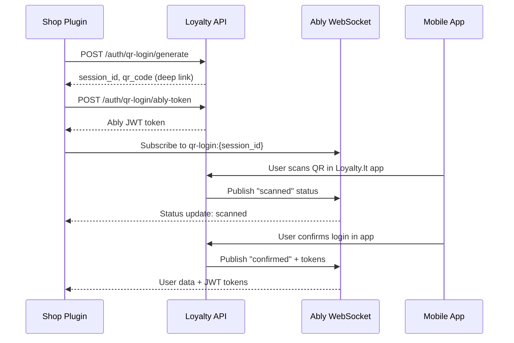

# QR Login System

The QR Login system allows users to authenticate on desktop/web by scanning a QR code with their mobile app. This is commonly used in custom shop plugin integrations.

<Info>
QR Login requires **Partner API authentication** (X-API-Key and X-API-Secret headers) and real-time WebSocket support via Ably.
</Info>

## Authentication Flow



---

## Generate QR Login Session

Create a new QR login session that generates a scannable QR code.

### Endpoint

```
POST /{locale}/shop/auth/qr-login/generate
```

### Authentication

<ParamField header="X-API-Key" type="string" required>
  Partner API key from Partners Portal
</ParamField>

<ParamField header="X-API-Secret" type="string" required>
  Partner API secret from Partners Portal
</ParamField>

### Request Body

<ParamField body="device_name" type="string">
  Optional name for the device requesting login
  
  **Example:** `"Shop Plugin - Checkout"`
</ParamField>

<ParamField body="shop_id" type="integer">
  Optional shop ID for multi-shop partners
</ParamField>

### Response

<ResponseField name="success" type="boolean">
  Indicates if session was created successfully
</ResponseField>

<ResponseField name="data" type="object">
  <Expandable title="data">
    <ResponseField name="session_id" type="string">
      Unique session identifier (UUID)
    </ResponseField>
    
    <ResponseField name="qr_code" type="string">
      Deep link URL for QR code: `loyaltylt://qr-login?code={code}&session={session_id}`
    </ResponseField>
    
    <ResponseField name="partner_name" type="string">
      Name of the partner business
    </ResponseField>
    
    <ResponseField name="partner_id" type="integer">
      Partner's unique identifier
    </ResponseField>
    
    <ResponseField name="shop_id" type="integer">
      Shop ID if provided (nullable)
    </ResponseField>
    
    <ResponseField name="expires_at" type="string">
      ISO 8601 timestamp when session expires (5 minutes)
    </ResponseField>
  </Expandable>
</ResponseField>

<RequestExample>

```bash cURL
curl -X POST "https://staging-api.loyalty.lt/en/shop/auth/qr-login/generate" \
  -H "Content-Type: application/json" \
  -H "X-API-Key: your_api_key" \
  -H "X-API-Secret: your_api_secret" \
  -d '{
    "device_name": "Shop Plugin - Checkout",
    "shop_id": 123
  }'
```

```javascript JavaScript
const response = await fetch('https://staging-api.loyalty.lt/en/shop/auth/qr-login/generate', {
  method: 'POST',
  headers: {
    'Content-Type': 'application/json',
    'X-API-Key': 'your_api_key',
    'X-API-Secret': 'your_api_secret'
  },
  body: JSON.stringify({
    device_name: 'Shop Plugin - Checkout',
    shop_id: 123
  })
});

const data = await response.json();
console.log('QR Code URL:', data.data.qr_code);
console.log('Session ID:', data.data.session_id);
```

</RequestExample>

<ResponseExample>

```json Success Response (200)
{
  "success": true,
  "data": {
    "session_id": "550e8400-e29b-41d4-a716-446655440000",
    "qr_code": "loyaltylt://qr-login?code=abcd1234efgh5678ijkl9012mnop3456&session=550e8400-e29b-41d4-a716-446655440000",
    "partner_name": "Coffee Paradise",
    "partner_id": 45,
    "shop_id": 123,
    "expires_at": "2024-12-08T15:35:00.000Z"
  }
}
```

</ResponseExample>

---

## Generate Ably Token

Get a secure Ably JWT token to subscribe to real-time QR login events.

### Endpoint

```
POST /{locale}/shop/ably/token
```

### Request Body

<ParamField body="session_id" type="string" required>
  The session ID from the generate endpoint
</ParamField>

### Response

<ResponseField name="data.token" type="string">
  Ably JWT token for WebSocket connection
</ResponseField>

<ResponseField name="data.expires" type="integer">
  Unix timestamp when token expires
</ResponseField>

<ResponseField name="data.channel" type="string">
  Ably channel name (automatically determined based on session type)
</ResponseField>

<ResponseField name="data.session_type" type="string">
  Type of session: `login` or `card_scan`
</ResponseField>

<RequestExample>

```bash cURL
curl -X POST "https://staging-api.loyalty.lt/en/shop/ably/token" \
  -H "Content-Type: application/json" \
  -H "X-API-Key: your_api_key" \
  -H "X-API-Secret: your_api_secret" \
  -d '{
    "session_id": "550e8400-e29b-41d4-a716-446655440000"
  }'
```

```javascript JavaScript
// After generating session, get Ably token
const tokenResponse = await fetch('https://staging-api.loyalty.lt/en/shop/ably/token', {
  method: 'POST',
  headers: {
    'Content-Type': 'application/json',
    'X-API-Key': 'your_api_key',
    'X-API-Secret': 'your_api_secret'
  },
  body: JSON.stringify({
    session_id: sessionId
  })
});

const { data } = await tokenResponse.json();

// Connect to Ably with the token
const ably = new Ably.Realtime({ token: data.token });
const channel = ably.channels.get(data.channel); // Use channel from response

channel.subscribe('qr_login_status', (message) => {
  console.log('Status:', message.data.status);
  
  if (message.data.status === 'confirmed') {
    console.log('User:', message.data.user);
    console.log('Token:', message.data.token);
    // User is authenticated!
  }
});
```

</RequestExample>

<ResponseExample>

```json Success Response (200)
{
  "success": true,
  "data": {
    "token": "eyJhbGciOiJIUzI1NiIsInR5cCI6IkpXVCJ9...",
    "expires": 1702054500,
    "channel": "qr-login:550e8400-e29b-41d4-a716-446655440000",
    "session_type": "login"
  }
}
```

</ResponseExample>

---

## Poll QR Login Status

Alternative to WebSockets: poll the session status periodically.

### Endpoint

```
POST /{locale}/shop/auth/qr-login/poll/{session_id}
```

### Path Parameters

<ParamField path="session_id" type="string" required>
  The QR login session ID
</ParamField>

### Response Statuses

| Status | Description |
|--------|-------------|
| `pending` | Waiting for user to scan QR code |
| `scanned` | User scanned QR, waiting for confirmation |
| `confirmed` | User confirmed login, tokens available |
| `expired` | Session expired (after 5 minutes) |

<RequestExample>

```bash cURL
curl -X POST "https://staging-api.loyalty.lt/en/shop/auth/qr-login/poll/550e8400-e29b-41d4-a716-446655440000" \
  -H "X-API-Key: your_api_key" \
  -H "X-API-Secret: your_api_secret"
```

```javascript JavaScript
// Polling approach (fallback when WebSockets unavailable)
async function pollQrLogin(sessionId) {
  const response = await fetch(
    `https://staging-api.loyalty.lt/en/shop/auth/qr-login/poll/${sessionId}`,
    {
      method: 'POST',
      headers: {
        'X-API-Key': 'your_api_key',
        'X-API-Secret': 'your_api_secret'
      }
    }
  );
  
  const data = await response.json();
  return data;
}

// Poll every 2 seconds
const interval = setInterval(async () => {
  const result = await pollQrLogin(sessionId);
  
  if (result.data.status === 'confirmed') {
    clearInterval(interval);
    // Handle successful login
  } else if (result.data.status === 'expired') {
    clearInterval(interval);
    // Handle expired session
  }
}, 2000);
```

</RequestExample>

<ResponseExample>

```json Pending Status
{
  "success": true,
  "data": {
    "session_id": "550e8400-e29b-41d4-a716-446655440000",
    "status": "pending",
    "expires_at": "2024-12-08T15:35:00.000Z"
  }
}
```

```json Confirmed Status
{
  "success": true,
  "data": {
    "session_id": "550e8400-e29b-41d4-a716-446655440000",
    "status": "confirmed",
    "user": {
      "id": 123,
      "name": "Jonas Jonaitis",
      "phone": "+37060000000",
      "email": "jonas@example.com"
    },
    "token": "eyJ0eXAiOiJKV1QiLCJhbGciOiJIUzI1NiJ9...",
    "refresh_token": "a1b2c3d4e5f6...",
    "expires_in": 3600
  }
}
```

```json Session Not Found (404)
{
  "success": false,
  "message": "QR session expired or not found",
  "code": "QR_SESSION_NOT_FOUND"
}
```

</ResponseExample>

---

## Session Timeline

<Steps>
  <Step title="Generate Session">
    Partner creates QR session (valid for 5 minutes)
  </Step>
  
  <Step title="Display QR Code">
    Convert deep link to QR code image for user to scan
  </Step>
  
  <Step title="Subscribe to Events">
    Connect to Ably WebSocket or start polling
  </Step>
  
  <Step title="User Scans">
    Mobile app user scans QR code (status: `scanned`)
  </Step>
  
  <Step title="User Confirms">
    User confirms login in mobile app (status: `confirmed`)
  </Step>
  
  <Step title="Receive Tokens">
    Shop plugin receives JWT tokens via WebSocket/polling
  </Step>
</Steps>

## Error Codes

| Code | Description | HTTP Status |
|------|-------------|-------------|
| `AUTH_FORBIDDEN` | Invalid or missing API credentials | 403 |
| `RESOURCE_NOT_FOUND` | Shop not found or access denied | 404 |
| `QR_SESSION_NOT_FOUND` | Session expired or invalid | 404 |
| `RESOURCE_EXPIRED` | QR code has expired | 410 |
| `INTERNAL_ERROR` | Server error | 500 |

## Best Practices

<CardGroup cols={2}>
  <Card title="Use WebSockets" icon="bolt">
    Prefer Ably WebSockets over polling for real-time updates
  </Card>
  
  <Card title="Handle Expiration" icon="clock">
    Sessions expire after 5 minutes - show countdown to users
  </Card>
  
  <Card title="Secure Storage" icon="lock">
    Store received tokens securely after successful login
  </Card>
  
  <Card title="Fallback Polling" icon="rotate">
    Implement polling as fallback if WebSockets fail
  </Card>
</CardGroup>
